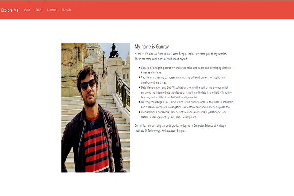
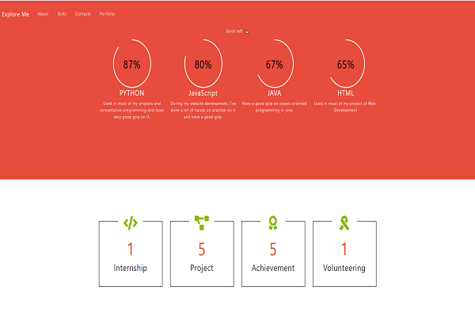
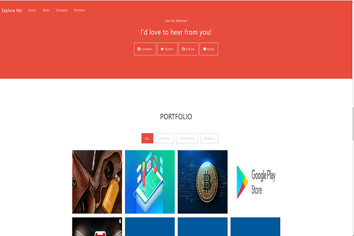

# gauravkumar97
<h3>In this website, I use the concept of HTML, CSS, JAVAScript, Bootstrap, and many other third-party tools.</h3>
<h4>Overview: </h4>
<ul>
  <li>
      Homepage
  </li> 
  
  
  <li>
      About Me
  </li> 
  
  
  <li>
      Skills
  </li> 
  
  
  <li>
      Portfolio
  </li> 
  
</ul>
